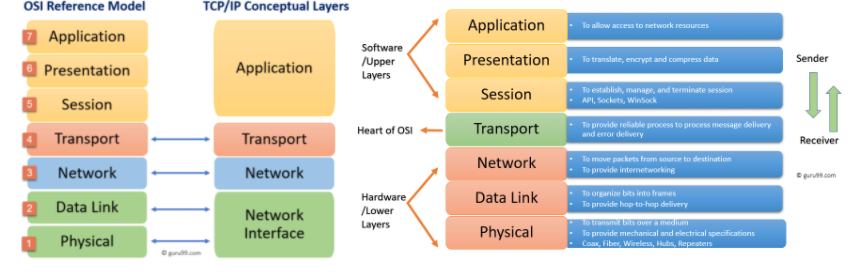
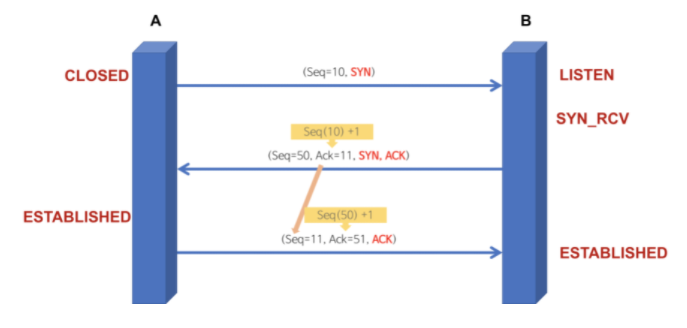
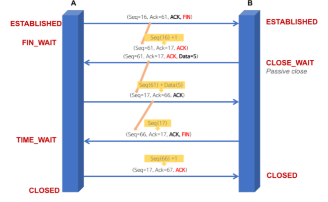

# Network

- OSI 7계층
- HTTP의 GET과 POST 비교
- TCP 3-way-handshake
- TCP와 UDP의 비교
- HTTP 와 HTTPS
  - HTTP의 문제점
- DNS Round Robin 방식
- 웹 통신의 큰 흐름

---

## OSI 7계층

> 개방형 시스템 상호 연결을 위한 기초 참조 모델(Open Systems Interconnection Reference Model)

OSI 7계층이란, 국제표준화기구(ISO)에서 개발한 모델로, 컴퓨터 네트워크 프로토콜 디자인과 통신을 계층으로 나누어 설명한 것이다.

쉽게 말하면, **네트워크에서 통신이 일어나는 과정을 7단계로 나눈 것**을 말한다. 계층 모델에 의해 프로토콜도 계층별로 구성된다. 현재 네트워크 시스템의 기반이 된 모델이며, 다양한 시스템은 이 계층 모델을 기반으로 통신한다.(현재의 인터넷은 각 계층의 역할들이 합쳐지면서 TCP/IP 4 계층 모델(링크, 인터넷, 전송, 응용 계층)을 기반으로 한다.)

OSI 7계층으로 나눈 이유는 **통신이 일어나는 과정을 단계별로 알 수 있고, 7단계 중 특정한 곳에 이상이 생기면 다른 단계와 독립적으로 그 단계만 수정할 수 있기 때문**이다.

OSI 7계층은 **물리, 데이터 링크, 네트워크, 전송, 세션, 표현, 응용 계층**으로 구성되어 있다.

### 프로토콜이란

> 메세지를 주고 받는 양식이나 규칙을 의미하는 통신 규약이다.

### OSI 7계층의 구조

**[1] 물리 계층 (Physical Layer) : 데이터 단위 bit | 프로토콜 DSL, ISDN 등**

- 장치 간 전기적 신호를 전달하는 계층이며, 데이터 프레임 내부의 각 bit를 한 노드에서 다음 노드로 실제로 이동시키는 계층이다.
- 인터넷의 Ethernet 또한 여러가지 물리 계층 프로토코를 갖고 있다.
- 이 계층의 장비로 대표적인 것은 허브, 리피터이다.

**[2] 데이터 링크 계층 (Data Link Layer) : 데이터 단위 frame | 프로토콜 PPP, Ethernet, Token ring, IEE 802.11(Wifi) 등**

- 데이터를 frame 단위로 한 네트워크 요소에서 이웃 네트워크 요소로 전송하는 계층이다. (물리 계층을 이용해 전송)
- 인터넷의 경우 Ethernet 프로토콜이 대표적이다. Ethernet은 MAC 주소를 이용해 Node-to-Node, Point -to-Point로 프레임을 전송한다.
- 이 계층의 장비로 대표적인 것은 스위치, 브릿지이다.

**[3] 네트워크 계층 (Network Layer) : 데이터 단위 datagram, packet | 프로토콜 IP, ICMP, ARP, RIP, BGP 등**

- 패킷을 한 호스트에서 다른 호스트로 라우팅하는 계층이다.(여러 라우터를 통한 라우팅, 그를 통한 패킷 전달)
- 전송 계층에게 전달 받은 목적지 주소를 이용해서 패킷을 만들고, 그 목적지의 전송 계층으로 패킷을 전달한다.
- 인터넷의 경우 IP 프로토콜이 대표적이다.

**[4] 전송 계층 (Transport Layer) : 데이터 단위 segment | 프로토콜 TCP, UDP, SCTP 등**

- 상위 계층의 메시지를 하위 계층으로 전송하는 계층이다.
- 메세지의 오류를 제어하며, 메세지가 클 경우 이를 나눠서(Segmentation) 네트워크 계층으로 전달한다. 그리고 받은 패킷을 재조립해서 상위 계층으로 전달한다.
- 대표적으로 TCP, UDP 프로토콜이 있다. TCP는 연결 지향형 통신을, UDP는 비연결형 통신을 제공한다.

**[5] 세션 계층 (Session Layer) : 데이터 단위 message | 프로토콜 NetBIOS, TLS 등**

- 데이터 교환의 경계와 동기화를 제공하는 계층이다.
- 세션 계층의 프로토콜은 연결이 손실되는 경우 연결 복구를 시도한다. 오랜시간 연결이 되지 않으면 세션 계층의 프로토콜이 연결을 닫고 다시 연결을 재개한다.
- 데이터를 상대방이 보내고 있을 때 동시에 보낼지에 대한 전이중(동시에 보냄, ex) 전화기), 반이중(동시에 보내지 않음, ex) 무전기) 통신을 결정할 수 있다.
- 인터넷의 계층 구조에는 포함되어 있지 않으며, 필요에 따라 응용 계층에서 지원하거나 어플리케이션 개발자가 직접 개발해야 한다.

**[6] 표현 계층 (Presentation Layer) : 데이터 단위 message | 프로토콜 ASCII, MPEG 등**

- 데이터의 암호화, 복호화와 같이 응용 계층에서 교환되는 데이터의 의미를 해석하는 계층이다.
- 응용 프로그램 ⇔  네트워크 간 정해진 형식대로 데이터를 변환, 즉 표현한다.
- 인터넷의 계층 구조에는 포함되어 있지 않으며, 필요에 따라 응용 계층에서 지원하거나 어플리케이션 개발자가 직접 개발해야한다.

**[7] 응용 계층 (Application Layer) : 데이터 단위 message | 프로토콜 HTTP, SMTP, FTP, SIP 등**

- 통신의 최종 목적지로, 응용 프로그램들이 통신으로 활용하는 계층이다.
- 사용자에게 가장 가까운 계층이며, 웹 브라우저, 응용 프로그램을 통해 사용자와 직접적으로 상호작용한다.
- 많은 프로토콜이 존재하는 계층으로, 새로운 프로토콜 추가도 굉장히 쉽다.

## HTTP의 GET과 POST 비교

둘 다 HTTP 프로토콜을 이용해서 서버에 무엇인가를 요청할 때 사용하는 방식이다. 하지만 둘의 특징을 제대로 이해하여 기술의 목적에 맞게 알맞은 용도로 사용해야한다.

### GET

> GET은 정보를 조회하기 위한 메서드로, 서버에서 어떤 데이터를 가져와서 보여주기 위한 용도이다.(SELECT)

GET 방식은 요청하는 데이터가 HTTP Request Message의 Header 부분에 URL이 담겨서 전송된다. 이로인해 URL 상에 `?` 뒤에 데이터가 붙어 `Request`를 보내게 되는 것이다. 이러한 방식은 URL 이라는 공간에 담겨가기 때문에 전송할 수 있는 데이터의 크기가 제한적이다. 또, 보안이 필요한 데이터에 대해서는 데이터가 그대로 URL에 노출된다.

GET 방식은 다음과 같은 특징이 있다.

1. URL에 요청 정보가 이어붙기 떄문에 데이터의 크기가 제한적이다.
2. HTTP 패킷의 Body는 비어 있는 상태로 전송된다.
3. 요청 데이터가 그대로 URL에 노출되므로 POST 방식보다 보안상 취약하다.
4. GET방식은 멱등성(Idempotent, 연산을 여러 번 적용하더라도 결과가 달라지지 않는 성질)이 적용된다.
5. 캐싱을 사용할 수 있어, GET `Request`와 그에 대한 `Response`가 브라우저에 의해 캐쉬되기 때문에 POST 방식보다 빠르다.

### POST

> POST는 서버의 값이나 상태를 바꾸기 위한 용도이다. (INSERT, UPDATE, DELETE)

POST 방식은 요청하는 데이터가 HTTP Request Message의 Body 부분에 담겨서 전송된다. Request Header의 Content-Type에 해당 데이터 타입이 표현되며, 전송하고자 하는 데이터 타입을 적어주어야 한다.

- Default : application/octet-stream
- 단순 txt : text/plain
- 파일 : multipart/form-data

POST 방식은 다음과 같은 특징이 있다.

1. Body 안에 데이터를 담아 전송하기 때문에 대용량의 데이터를 전송하기에 적합하다.
2. GET 방식보다 보안상 안전하지만, 암호화를 하지 않는 이상 보안에 취약한 것은 같다.
3. 클라이언트 쪽에서 데이터를 인코딩하여 서버로 전송하고, 이를 받은 서버 쪽이 해당 데이터를 디코딩한다.

## TCP 3-Way-Handshake & 4-Way-Handshake

> 참고 : https://gmlwjd9405.github.io/2018/09/19/tcp-connection.html

TCP는 네트워크 계층 중 전송 계층에서 사용하는 프로토콜 중 하나로, 신뢰성을 보장하는 연결형 서비스이다.

TCP의 `3-Way-Handshake`란 TCP 통신을 시작하기 전에 **논리적인 경로 연결을 수립(Connection Establish)**하는 과정이며, `4-Way-Handshake`는 **논리적인 경로 연결을 해제(Connection Termination)** 하는 과정이다. 이러한 방식을 Connect Oriented 방식이라 부르기도 한다.

### TCP 3-Way-Handshake : Connection Establish

3-Way-Handshake 과정을 통해 양쪽 모두 데이터를 전송할 준비가 되었다는 것을 보장한다.

A 프로세스(Client) 가 B 프로세스(Server)에 연결을 요청

1. A(Closed) -> B(Listen) : SYN(a)
   - 프로세스 A가 연결 요청 메세지 전송(SYN)
2. B(SYN_RCV) -> A(Closed) : ACK(a+1), SYN(b)
   - 연결 요청 메세지를 받은 프로세스 B는 요청을 수락(ACK)했으며, 요청한 A 프로세스도 포트를 열어달라(SYN)는 메세지 정송
   - 받은 메세지에 대한 수락에 대해서는 Acknowledgement Number 필드를 (Sequence Number + 1)로 지정하여 표현한다. 그리고 SYN과 ACK 플래그 비트를 1로 설정한 Segment를 전송한다.
3. A(Established) -> B(SYN_RCV) : ACK(b+1)
   - 마지막으로 프로세스 A가 수락 확인을 보내 연결을 맺음(ACK)
   - 이 때, 전송할 데이터가 있으면, 이 단계에서 데이터를 전송할 수 있다.

최종 Port 상태 : A-Established, B-Established (연결 수립)

### TCP 4-Way-Handshake : Connection Termination

A  프로세스(Client)가 B 프로세스(Server)에 연결 해제를 요청

1. 