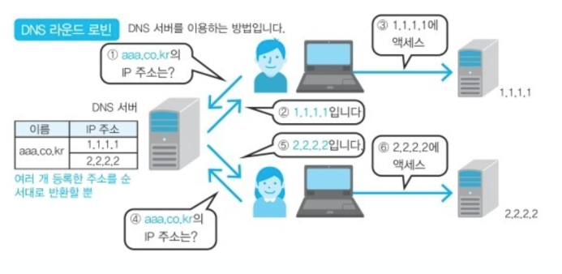
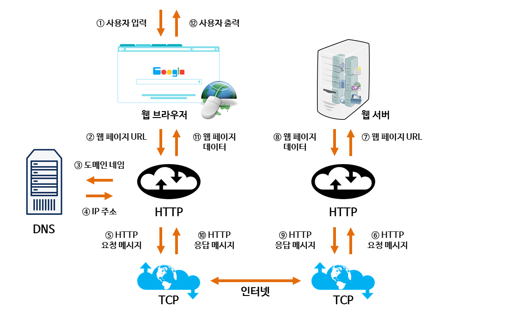

# Network

[TOC]

---

## OSI 7계층

> 개방형 시스템 상호 연결을 위한 기초 참조 모델(Open Systems Interconnection Reference Model)

OSI 7계층이란, 국제표준화기구(ISO)에서 개발한 모델로, 컴퓨터 네트워크 프로토콜 디자인과 통신을 계층으로 나누어 설명한 것이다.

쉽게 말하면, **네트워크에서 통신이 일어나는 과정을 7단계로 나눈 것**을 말한다. 계층 모델에 의해 프로토콜도 계층별로 구성된다. 현재 네트워크 시스템의 기반이 된 모델이며, 다양한 시스템은 이 계층 모델을 기반으로 통신한다.(현재의 인터넷은 각 계층의 역할들이 합쳐지면서 TCP/IP 4 계층 모델(링크, 인터넷, 전송, 응용 계층)을 기반으로 한다.)

OSI 7계층으로 나눈 이유는 **통신이 일어나는 과정을 단계별로 알 수 있고, 7단계 중 특정한 곳에 이상이 생기면 다른 단계와 독립적으로 그 단계만 수정할 수 있기 때문**이다.

OSI 7계층은 **물리, 데이터 링크, 네트워크, 전송, 세션, 표현, 응용 계층**으로 구성되어 있다.

### 프로토콜이란

> 메세지를 주고 받는 양식이나 규칙을 의미하는 통신 규약이다.

### OSI 7계층의 구조

**[1] 물리 계층 (Physical Layer) : 데이터 단위 bit | 프로토콜 DSL, ISDN 등**

- 장치 간 전기적 신호를 전달하는 계층이며, 데이터 프레임 내부의 각 bit를 한 노드에서 다음 노드로 실제로 이동시키는 계층이다.
- 인터넷의 Ethernet 또한 여러가지 물리 계층 프로토코를 갖고 있다.
- 이 계층의 장비로 대표적인 것은 허브, 리피터이다.

**[2] 데이터 링크 계층 (Data Link Layer) : 데이터 단위 frame | 프로토콜 PPP, Ethernet, Token ring, IEE 802.11(Wifi) 등**

- 데이터를 frame 단위로 한 네트워크 요소에서 이웃 네트워크 요소로 전송하는 계층이다. (물리 계층을 이용해 전송)
- 인터넷의 경우 Ethernet 프로토콜이 대표적이다. Ethernet은 MAC 주소를 이용해 Node-to-Node, Point -to-Point로 프레임을 전송한다.
- 이 계층의 장비로 대표적인 것은 스위치, 브릿지이다.

**[3] 네트워크 계층 (Network Layer) : 데이터 단위 datagram, packet | 프로토콜 IP, ICMP, ARP, RIP, BGP 등**

- 패킷을 한 호스트에서 다른 호스트로 라우팅하는 계층이다.(여러 라우터를 통한 라우팅, 그를 통한 패킷 전달)
- 전송 계층에게 전달 받은 목적지 주소를 이용해서 패킷을 만들고, 그 목적지의 전송 계층으로 패킷을 전달한다.
- 인터넷의 경우 IP 프로토콜이 대표적이다.

**[4] 전송 계층 (Transport Layer) : 데이터 단위 segment | 프로토콜 TCP, UDP, SCTP 등**

- 상위 계층의 메시지를 하위 계층으로 전송하는 계층이다.
- 메세지의 오류를 제어하며, 메세지가 클 경우 이를 나눠서(Segmentation) 네트워크 계층으로 전달한다. 그리고 받은 패킷을 재조립해서 상위 계층으로 전달한다.
- 대표적으로 TCP, UDP 프로토콜이 있다. TCP는 연결 지향형 통신을, UDP는 비연결형 통신을 제공한다.

**[5] 세션 계층 (Session Layer) : 데이터 단위 message | 프로토콜 NetBIOS, TLS 등**

- 데이터 교환의 경계와 동기화를 제공하는 계층이다.
- 세션 계층의 프로토콜은 연결이 손실되는 경우 연결 복구를 시도한다. 오랜시간 연결이 되지 않으면 세션 계층의 프로토콜이 연결을 닫고 다시 연결을 재개한다.
- 데이터를 상대방이 보내고 있을 때 동시에 보낼지에 대한 전이중(동시에 보냄, ex) 전화기), 반이중(동시에 보내지 않음, ex) 무전기) 통신을 결정할 수 있다.
- 인터넷의 계층 구조에는 포함되어 있지 않으며, 필요에 따라 응용 계층에서 지원하거나 어플리케이션 개발자가 직접 개발해야 한다.

**[6] 표현 계층 (Presentation Layer) : 데이터 단위 message | 프로토콜 ASCII, MPEG 등**

- 데이터의 암호화, 복호화와 같이 응용 계층에서 교환되는 데이터의 의미를 해석하는 계층이다.
- 응용 프로그램 ⇔  네트워크 간 정해진 형식대로 데이터를 변환, 즉 표현한다.
- 인터넷의 계층 구조에는 포함되어 있지 않으며, 필요에 따라 응용 계층에서 지원하거나 어플리케이션 개발자가 직접 개발해야한다.

**[7] 응용 계층 (Application Layer) : 데이터 단위 message | 프로토콜 HTTP, SMTP, FTP, SIP 등**

- 통신의 최종 목적지로, 응용 프로그램들이 통신으로 활용하는 계층이다.
- 사용자에게 가장 가까운 계층이며, 웹 브라우저, 응용 프로그램을 통해 사용자와 직접적으로 상호작용한다.
- 많은 프로토콜이 존재하는 계층으로, 새로운 프로토콜 추가도 굉장히 쉽다.

## HTTP의 GET과 POST 비교

둘 다 HTTP 프로토콜을 이용해서 서버에 무엇인가를 요청할 때 사용하는 방식이다. 하지만 둘의 특징을 제대로 이해하여 기술의 목적에 맞게 알맞은 용도로 사용해야한다.

### GET

> GET은 정보를 조회하기 위한 메서드로, 서버에서 어떤 데이터를 가져와서 보여주기 위한 용도이다.(SELECT)

GET 방식은 요청하는 데이터가 HTTP Request Message의 Header 부분에 URL이 담겨서 전송된다. 이로인해 URL 상에 `?` 뒤에 데이터가 붙어 `Request`를 보내게 되는 것이다. 이러한 방식은 URL 이라는 공간에 담겨가기 때문에 전송할 수 있는 데이터의 크기가 제한적이다. 또, 보안이 필요한 데이터에 대해서는 데이터가 그대로 URL에 노출된다.

GET 방식은 다음과 같은 특징이 있다.

1. URL에 요청 정보가 이어붙기 떄문에 데이터의 크기가 제한적이다.
2. HTTP 패킷의 Body는 비어 있는 상태로 전송된다.
3. 요청 데이터가 그대로 URL에 노출되므로 POST 방식보다 보안상 취약하다.
4. GET방식은 멱등성(Idempotent, 연산을 여러 번 적용하더라도 결과가 달라지지 않는 성질)이 적용된다.
5. 캐싱을 사용할 수 있어, GET `Request`와 그에 대한 `Response`가 브라우저에 의해 캐쉬되기 때문에 POST 방식보다 빠르다.

### POST

> POST는 서버의 값이나 상태를 바꾸기 위한 용도이다. (INSERT, UPDATE, DELETE)

POST 방식은 요청하는 데이터가 HTTP Request Message의 Body 부분에 담겨서 전송된다. Request Header의 Content-Type에 해당 데이터 타입이 표현되며, 전송하고자 하는 데이터 타입을 적어주어야 한다.

- Default : application/octet-stream
- 단순 txt : text/plain
- 파일 : multipart/form-data

POST 방식은 다음과 같은 특징이 있다.

1. Body 안에 데이터를 담아 전송하기 때문에 대용량의 데이터를 전송하기에 적합하다.
2. GET 방식보다 보안상 안전하지만, 암호화를 하지 않는 이상 보안에 취약한 것은 같다.
3. 클라이언트 쪽에서 데이터를 인코딩하여 서버로 전송하고, 이를 받은 서버 쪽이 해당 데이터를 디코딩한다.

## TCP 3-Way-Handshake & 4-Way-Handshake

> 참고 : https://gmlwjd9405.github.io/2018/09/19/tcp-connection.html

TCP는 네트워크 계층 중 전송 계층에서 사용하는 프로토콜 중 하나로, 신뢰성을 보장하는 연결형 서비스이다.

TCP의 `3-Way-Handshake`란 TCP 통신을 시작하기 전에 **논리적인 경로 연결을 수립(Connection Establish)**하는 과정이며, `4-Way-Handshake`는 **논리적인 경로 연결을 해제(Connection Termination)** 하는 과정이다. 이러한 방식을 Connect Oriented 방식이라 부르기도 한다.

### TCP 3-Way-Handshake : Connection Establish

3-Way-Handshake 과정을 통해 양쪽 모두 데이터를 전송할 준비가 되었다는 것을 보장한다.

A 프로세스(Client) 가 B 프로세스(Server)에 연결을 요청

1. A(Closed) -> B(Listen) : SYN(a)
   - 프로세스 A가 연결 요청 메세지 전송(SYN)
2. B(SYN_RCV) -> A(Closed) : ACK(a+1), SYN(b)
   - 연결 요청 메세지를 받은 프로세스 B는 요청을 수락(ACK)했으며, 요청한 A 프로세스도 포트를 열어달라(SYN)는 메세지 정송
   - 받은 메세지에 대한 수락에 대해서는 Acknowledgement Number 필드를 (Sequence Number + 1)로 지정하여 표현한다. 그리고 SYN과 ACK 플래그 비트를 1로 설정한 Segment를 전송한다.
3. A(Established) -> B(SYN_RCV) : ACK(b+1)
   - 마지막으로 프로세스 A가 수락 확인을 보내 연결을 맺음(ACK)
   - 이 때, 전송할 데이터가 있으면, 이 단계에서 데이터를 전송할 수 있다.

최종 Port 상태 : A-Established, B-Established (연결 수립)

### TCP 4-Way-Handshake : Connection Termination

A  프로세스(Client)가 B 프로세스(Server)에 연결 해제를 요청

1. A(Established) -> B(Established) : FIN
   - 프로세스 A가 연결을 종료하겠다는 FIN 플래그를 전송
   - 프로세스 B가 FIN 플래그로 응답하기 전까지 연결을 유지
2. B(ClOSE_Wait) -> A(FIN_WAIT) : ACK
   - 프로세스 B는 확인 메세지(ACK)를 보내고 자신의 통신이 끝날 때까지 기다린다.
   - Acknowledgement Number 필드를 (Sequence Number + 1)로 지정하고, ACK 플래그 비트를 1로 설정한 Segment를 전송한다.
   - 그리고 자신이 전송할 데이터가 남아있다면 이어서 계속 전송한다. (클라이언트 쪽에서도 아직 서버로부터 받지 못한 데이터가 있을 것을 대비해 일정 시간동안 세션을 남겨놓고 패킷을 기다린다. 이를 TIME_WAIT 상태라고 한다.)
3. B(CLOSE_WAIT) -> A(FIN_WAIT) : FIN
   - 프로세스 B의 통신이 끝나면 이제 연결 종료해도 괜찮다는 의미로 프로세스 A에게 FIN 플래그를 전송한다.
4. A(TIME_WAIT) -> B(LAST_ACK) : ACK
   - 프로세스 A는 FIN 메세지를 확인했다는 메세지를 전송(ACK)
   - 프로세스 A로부터 ACK 메세지를 받은 프로세스 B는 소켓 연결을 해제한다.

최종 PORT 상태 : A-CLOSED, B-CLOSED (연결 해제)

## TCP와 UDP

### UDP

`UDP(User Datagram Protocol, 사용자 데이터그램 프로토콜)`은 비연결형 프로토콜이다. IP 데이터그램을 캡슐화하여 보내는 방법과 연결 설정을 하지 않고 보내는 방법을 제공한다. `UDP` 는 **흐름제어, 오류제어 또는 손상된 세그먼트의 수신에 대한 재전송을 하지 않는다.** 이 모두가 사용자 프로세스의 몫이다. `UDP`가 행가는 것은 포트들을 사용하여 IP 프로토콜에 인터페이스를 제공하는 것이다.

종종 클라이언트는 서버로 잛은 요청을 보내고, 짧은 응답을 기대한다. 만약 요청 또는 응답이 손실된다면, 클라이언트는 TIME OUT 되고 다시 시도할 수 있으면 된다. 코드가 간단할 뿐만 아니라 TCP 처럼 초기설정(initial setup)에서 요구되는 프로토콜보다 적은 메세지가 요구된다.

`UDP`를 사용한 것들에는 `DNS`가 있다. 어떤 호스트 네임의 IP 주소를 찾을 필요가 있는 프로그램은 DNS 서버로 호스트 네임을 포함한 UDP 패킷을 보낸다. 이 서버는 호스트의 IP 주소를 포함한 UDP 패킷으로 응답한다. 사전에 설정이 필요하지 않으며 그 후에 해제가 필요하지 않다.

### TCP

대부분의 인터넷 응용 분야들은 **신뢰성과 순차적인 전달**을 필요로 한다. UDP로는 이를 만족시킬 수 없으므로 다른 프로토콜이 필요하여 탄생한 것이 `TCP`이다. `TCP(Transmission Control Protocol, 전송제어 프로토콜)`는 신뢰성이 없는 인터넷을 통해 종단간에 신뢰성 있는 바이트 스트림을 전송하도록 특별히 설계되었다. TCP 서비스는 송신자와 수신자 모두가 소켓이라고 부르는 종단점을 생성함으로써 이루어진다. TCP에서 연결설정은 `3-way-handshake`를 통해행해진다.

모든 TCP 연결은 **전이중(Full-Duplex), 점대점(Point to Point)방식**이다. 전이중이란 전송이 양방향으로 동시에 일어날 수 있음을 의미하며 점대점이란 각 연결이 정확히 2개의 종단덤을 가지고 있음을 의미한다. TCP는 **멀티캐스팅이나 브로드 캐스팅을 지원하지 않는다.**

## HTTP와 HTTPS

### HTTP

HTTP(HyperText Transfer Protocol)

- OSI 7계층 중 7계층 응용계층에 속하는 프로토콜이다.
- Stateless 한 특성을 갖는 프로토콜이다.
- Method, Path, Version, Header, Body 등으로 구성된다.
- Request와 Response로 통신을 하는 비연결성 프로토콜이다.

HTTP의 문제점

- 평문 텍스트, 즉 암호화되지 않은 텍스트를 전송하는 프로토콜로, 중간자 공격에 취약하다.
- 변조, 위장, 도청에 취약하다.

### HTTPS

HTTPS(HyperText Transfer Protocol over Secure Socket Layer = HTTP over SSL = HTTP over TLS)

쉽게 말해서 HTTP의 단점인 보안성을 보완한 프로토콜이다. 데이터 암호화 기능이 추가되었다고 생각하면 된다.

HTTPS는 `SSL`이라는 프로토콜을 사용하여 데이터를 암호화한다.

>  SSL이란? 공개키 암호화를 기반으로 동작하는 프로토콜이다.

- SSL 사용 목적
  1. 통신내용이 공격자에게 노출되는 것을 막을 수 있다.
  2. 클라이언트가 접속하려는 서버가 신뢰할 수 있는 서버인지 판단할 수 있다.
  3. 통신내용의 악의적인 변경을 방지할 수 있다.

즉, `SSL`은 위와 같은 목적을 위해 `인증서`를 사용한다. 이 인증서는 `CA(Certificate Authority)`에서 발급해준다. 믿을만한 기관인 `CA`에게서 인증서를 발급받은 서버는 클아이언트 입장에서 믿고 사용할 수 있다.

SSL은 이러한 인증서를 통해 클라이언트와 서버가 보안적으로 안정한 상태로 통신하게 돕는다.

### 인증서와 SSL의 동작 과정

인증서에는 아래와 같은 내용이 담겨있다.

- 서비스 서버의 정보(인증서를 발급한 CA, 서비스 서버의 도메인)
- 서비스 서버 측 공개키 (공개 키 값, 공개 키 암호화 방법)

그리고 브라우저는 CA의 리스트와 그 공개 키들을 가지고 있다. SSL의 동작 과정 중 일부를 간략하게 설명해자면

1. 클라이언트가 서버에 접속/요청한다. (handshake + 랜덤 데이터를 보낸다)
2. 서버는 클라이언트에게 CA의 비밀키로 암호화된 인증서를 제공한다. (handshake + 랜덤 데이터를 보낸다)

// 이 랜덤 데이터는 앞으로 통신에서 사용할 세션 키를 생성하는 과정 중 하나이다.

3. 클라이언트는 본인이 가지고 있는 CA 리스트와 인증서에 담긴 CA 정보를 비교한다.
4. 일치한다면 해당 CA의 공개키로 인증서를 복호화한다.
   - 인증서가 CA가 암호화한 것임을 알 수 있음(= 신뢰 가능)

이렇게 신뢰할 만한 서버임을 보장받은 상태에서 클라이언트는 서로 받은 랜덤 데이터를 조합하여 `Premaster Secret` 키를 생성한다. 이 때 인증서에 담겨있던 `서비스 서버 측 공개키`를 사용하여 암호화한다. 이렇게 암호화된 `Premaster Secret`키를 서버에게 전송한다. 그렇다면 현재 서버와 클라이언트 모두 `Premaster Secret` 즉 대칭키로 사용 가능한 키를 갖게 된다. 이 `Premaster Secret`을 일련의 과정을 거쳐 `Session Key`로 만든 후 향후 있을 서버/클라이언트 간 통신에 사용하게 되는 것이다.

### Session Key

이 Session Key는 공개키 와 대칭키가 결합된 방식이다. 굳이 왜 결합해서 쓸까? 

공개키 방식은 많은 컴퓨팅 자원을 요구한다. 시간이 많이 걸린다는 것이다. 따라서 대칭키를 공개키 방식으로 암호화된 세션 키를 사용하면 더 안전하고 빠른 통신을 할 수 있기 때문이다.

### 인증서

크롬 브라우저에서 주소창 왼쪽을 보면 자물쇠가 보일 것입니다. HTTPS를 사용중인 곳이라면 다음과 같이 HTTPS 사용되었습니다 문구가 보입니다.

## DNS round robin 방식

### DNS 란?

> 사람이 읽을 수 있는 도메인 이름(ex.naver.com)을 기계가 읽을 수 있는 IP 주소로 변환 하거나 IP를 넣으면 해당하는 도메인을 반환하는 시스템

- 브라우저에 도메인 www.naver.com 입력

1. DNS로 부터 얻은 IP로 HTTP 서비스 요청
2. www.naver.com 서버는 요청에 따른 HTTP 서비스를 반환
3. 전달받은 HTTP 서비스를 브라우저에 출력한다.

이 과정에서 만약 naver.com에 부하가 걸리면 ??

### ROUND ROBIN

- DNS를 이용하여 부하분산을 이용
- DNS 서버에서 하나의 도메인명에 여러 개의 IP 주소를 등록시켜두고, 클라이언트로부터 요청이 있으면 등록되어 있는 IP 주소를 순서대로 반환하는 방식
- 반환되는 IP 주소가 바뀌므로 클라이언트의 행선지도 바뀌어 결과적으로 커넥션이 분배된다.

### ROUND ROBIN 문제점

1. 서버의 수 만큼 공인 IP 주소가 필요하다.
2. 균등하게 분산되지 않는다.
   - 스마트폰 접속의 경우, 프록시 서버로 경유하는데 프록시 서버에서는 변환 결과가 일정 시간동안 캐싱됨. 같은 프록시 서버를 경유하는 접속은 항상 같은 서버로 접속한다.
3. 서버가 다운되어도 확인불가
   - DNS 서버는 웹 서버의 부하나 접속 수 등의 상황에 따라 질의 결과를 제어할 수 없음
   - 전혀 감지가 안되기 때문에 어떤 원인으로 다운돼도 검출하지 못하고 유저에게 제공

**DNS는 부하분산용이지 다중화 방법이 아니므로 다른 SW와 조합후 사용해야한다.**

### ROUND ROBIN 문제 보완 방법

1. Weighted round robin (WRR)
   - 각각의 웹 서버에 가중치를 가미해서 분산 비율을 변경 => 가중치가 큰 서버일 수록 빈번하게 선택되므로 처리능력이 높은 서버는 가중치를 높게 설정한다.
2. Least Connection
   - 접속 클라이언트 수가 가장 적은 서버를 선택 => 로드밸런서에서 실시간으로 connection 수를 관리하거나 각 서버에서 주기적으로 알려주는 것이 필요

`로드밸런서` : 서버에 가해지는 부하(=로드)를 분산(=밸런싱) 해주는 장치 또는 기술을 통칭. 한 대의 서버로 부하가 집중되지 않도록 트래픽을 관리해 각각의 서버가 최적의 퍼포먼스를 보일 수 있게 함.

## 웹 통신의 큰 흐름

### 웹이란 ?

`WWW(World Wide Web)` 의 약자이며 인터넷으로 연결된 컴퓨터를 통해 정보를 공유할 수 있는 공간을 뜻한다. 흔히들 웹과 인터ㅔㅅ을 통용하여 사용하는데 엄연히 다른 개념이다.

### 웹 통신

기본적으로 웹 통신은 `HTTP 프로토콜`을 사용하여 통신한다.

통신의 주체를 크게 `Client`와 `Server`로 나눌 수 있다.

- **Client** : 서버에게 정보를 요청하거나 접속하고자 하는 주체
  - ex) 브라우저
- **Server** : 클라이언트에게 정보 혹은 서비스를 제공하는 컴퓨터(혹은 시스템)

이러한 Client와 Server가 `Request`와 `Response` 를 주고받으며 통신이 일어난다.

### 웹 통신 세부과정

주소창에 `www.naver.com` 해당 URL을 입력 한 뒤 클라이언트에 화면이 렌더링 되기까지 어떤 과정이 있을까 ?

그 전에 `IP 주소`와 `도메인 이름` 그리고 이 둘의 관계에 대해 알아보자

- IP 주소 : 컴퓨터들의 고유 식별번호로 생각하면 된다. IP 주소는 `127.0.0.1`과 같은 형태의 숫자로 나타난다.
  - 현재는 .으로 구분된 각 자리에서 0~255를 나타낼 수 있는 32비트의 IPv4 프로토콜을 사용하나, 인터넷 사용자 수 증가로 IP 주소 부족 현상이 일어났고, 이는 128비트의 IPv6 이 등장하는 배경이 되었다.
- 도메인 이름 : 사람이 쉽게 외울 수 있도록 IP 주소를 어떠한 문자로 표현한 것을 의미한다. 즉, 위 URL에서 `www.naver.com`이 도메인 이름에 해당한다.
  - 터미널을 켠 뒤 `host naver.com`을 입력해보자 `naver.com` 도메인이 갖는 IP 주소를 알 수 있고, 주소창에 해당 IP 주소를 입력하면 도메인을 입력했을 때와 같은 결과를 얻는다.

즉, 브라우저에 입력된 도메인 이름을 통해 해당 도메인의 IP 주소를 얻은 뒤 통신을 시작할 수 있다는 것이다.

이러한 `도메인 이름 -> IP`과정에서 필요한 도우미 역할을 하는 것이 `DNS`이다.

다음의 그림과 함께 살펴보자.

작동 과정은 다음과 같다.

1. 사용자가 **도메인 이름** 입력
2. **DNS** 를 통해 도메인 이름과 매핑되는 IP 주소 획득
3. **HTTP** 프로토콜을 사용하여 요청(=HTTP Request) 생성
4. **TCP** 프로토콜을 사용하여 **서버의 IP 주소 컴퓨터**로 Request 전송
5. 서버가 클라이언트의 **요청**에 대한 **응답**(=HTTP Response) 전송
6. 브라우저에 도착한 Response는 **웹페이지를 나타내는 데이터**로 변환되어 브라우저에 나타남

## 질의응답

이전에 저희 회사의 서비스를 제공받는 모든 고객의 pc에서 서비스 중단 이 일어났습니다. OSI 7계층의 관점으로 몇번째 계층의 문제임을 예상할 수 있을까요?

HTTP는 연결성일까요, 비 연결성일까요 ? 근거를 들어 말해주세요

비연결성

